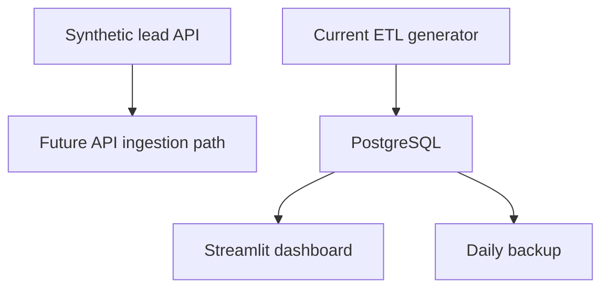

# Lead Conversion Analytics Prototype

A Docker Compose prototype for exploring how gym leads move from acquisition to membership, with PostgreSQL storage and a Streamlit dashboard.

All records in this repository are **synthetic**. The project is a portfolio architecture exercise, not a deployed system or a record of a real gym's customers.

## What is implemented

The repository defines six services:

| Service | Purpose | Port |
|---|---|---:|
| `db` | PostgreSQL 15 database | 5432 |
| `adminer` | Browser-based database inspection | 8080 |
| `api-server` | Flask endpoint generating example leads | 8000 |
| `server-etl` | One-shot synthetic lead generator and database loader | internal |
| `dashboard` | Streamlit tables, filters, and conversion KPIs | 8501 |
| `db-backup` | Daily `pg_dump` loop | internal |



The API and the current ETL container are separate paths. The Compose-managed ETL does not yet consume the Flask endpoint, so the diagram labels API ingestion as future work.

## Data model

The SQL schema separates:

- Clubs and staff
- Leads and conversion status
- Members and subscriptions
- A placeholder staff-metrics table

Foreign keys connect operational records to their club, assigned staff member, and resulting membership. The database starts with three clubs, three salespeople, and six example leads. The ETL container generates 30 additional random leads on each run.

## Dashboard

The Streamlit app reads PostgreSQL tables and provides:

- Lead creation-date, club, and staff filters
- Lead, member, subscription, staff, and club tables
- Total leads, converted leads, and conversion rate
- Lead-source counts and converted leads by staff member

These are descriptive prototype metrics. The repository does not contain measured business impact or a production user study.

## Run locally

```bash
docker compose up --build
```

Then open:

- Dashboard: [http://localhost:8501](http://localhost:8501)
- API example: [http://localhost:8000/leads](http://localhost:8000/leads)
- Adminer: [http://localhost:8080](http://localhost:8080)

Local development credentials are defined directly in `docker-compose.yml`. They are demonstration-only and must be replaced with secrets in any shared environment.

To reset the demo database and rerun `db/init.sql`:

```bash
docker compose down -v
docker compose up --build
```

The `-v` option deletes the local PostgreSQL volume.

## Repository structure

```text
api-server/        Flask synthetic-lead endpoint
server-etl/        Compose-managed lead generator and legacy ingestion experiments
dashboard/         Streamlit application
db/init.sql        relational schema and seed data
docker-compose.yml service topology and local configuration
fetch_leads.py     alternate API/encrypted-file ingestion prototype
```

## Known gaps

- The Compose-managed ETL does not call `api-server`.
- `fetch_leads.py` is not wired into Docker Compose and refers to `created_date`, while the database schema uses `creation_date`.
- The SQL schema uses `ON CONFLICT (email)` without declaring the corresponding email uniqueness constraint.
- The ETL is not idempotent and repeated runs append random leads.
- Service dependencies do not include readiness health checks.
- Dependencies are not pinned consistently.
- There are no automated tests or CI checks.
- `server-etl/server.py` is an opaque legacy artifact and is not used by the Compose service.

## Refinement path

Before presenting this as an end-to-end analytics system, I would:

1. Make the API record ID a unique source key.
2. Replace random inserts with idempotent API upserts.
3. Align the ETL field names with the SQL schema.
4. Add database and API health checks.
5. Test conversion metrics and status transitions.
6. Pin dependencies and add CI.
7. Remove or replace the opaque legacy artifact.
8. Move local database credentials into environment configuration.

## Portfolio position

This repository demonstrates relational modelling, container orchestration, and dashboard prototyping. It remains supporting evidence until the ingestion path and reliability gaps above are fixed.
